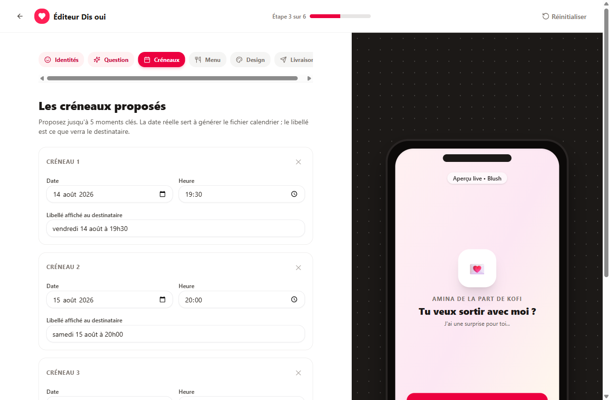
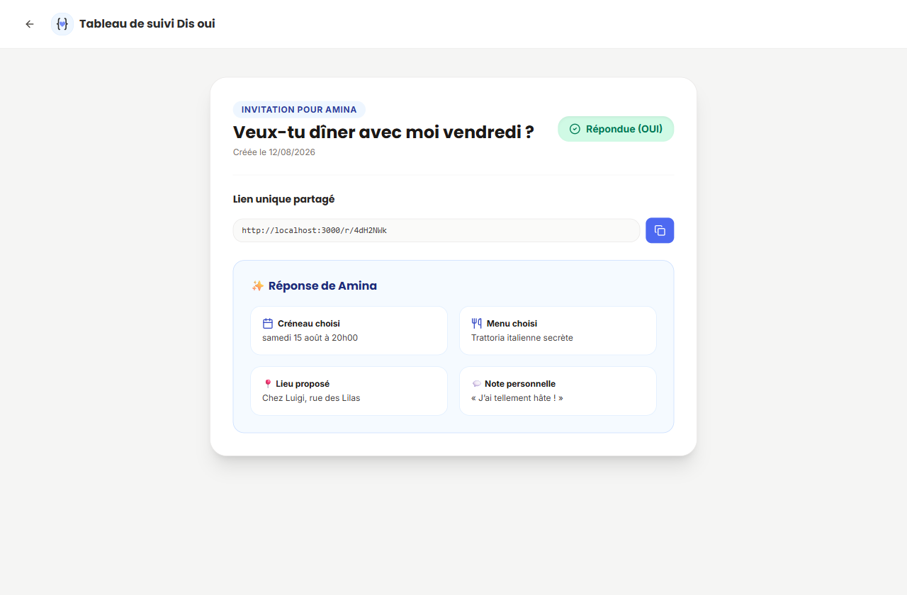
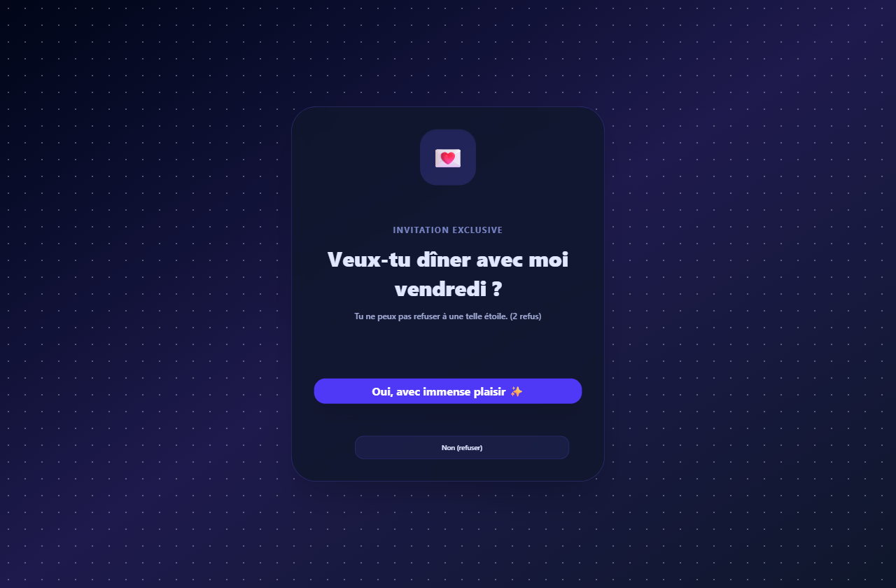

<div align="center">


# Dis oui

**Transformez une demande de rendez-vous en petit moment de suspense.**

Le créateur compose une invitation en six étapes, partage un lien,
et reçoit la réponse par e-mail avec un fichier calendrier prêt à ouvrir.
Aucun compte, aucun mot de passe.

Un produit **[ByTechnum](https://github.com/Magloire04)** — la technologie à votre portée.


</div>

---

## Comment ça marche

```text
   Créateur                        Destinataire                    Créateur
      │                                  │                             │
  ┌───┴────┐   lien /r/xxxx   ┌──────────┴─────────┐   e-mail   ┌──────┴──────┐
  │ Éditeur│ ───────────────► │ Enveloppe, question│ ─────────► │ Suivi privé │
  │6 étapes│                  │ créneaux, menu     │  + .ics    │ /track/yyyy │
  └────────┘                  └────────────────────┘            └─────────────┘
```

1. **Personnaliser** — prénoms, ton, question, créneaux datés, menu, thème.
2. **Partager** — un lien unique, ou son QR code, par WhatsApp ou SMS.
3. **Recevoir** — la réponse arrive par e-mail, fichier `.ics` en pièce jointe.

---

## Ce que ça fait

| | |
|---|---|
| **Bouton « Non » taquin** | il fuit le curseur, rétrécit à chaque clic, ou les deux — puis rend les armes en laissant une vraie porte de sortie |
| **Sept thèmes** | Blush, Minuit, Agrume, Forêt, Sépia, Néon et ByTechnum — chacun habille les six écrans, pas seulement le fond |
| **Créneaux datés** | le libellé garde la formulation libre (« vendredi soir »), la date réelle alimente le fichier calendrier |
| **Fichier `.ics` valide** | conforme RFC 5545, généré par le même code côté client et côté serveur |
| **Aperçus de partage neutres** | coller le lien affiche « Quelqu'un t'a envoyé quelque chose 👀 », jamais le contenu |
| **Suppression automatique** | à l'échéance choisie, l'invitation et sa réponse disparaissent de la base |
| **Accessible** | parcours clavier, `aria-live` sur les taquineries, respect de `prefers-reduced-motion` |

<table>
<tr>
<td width="50%"><br><em>L'éditeur et son aperçu en temps réel</em></td>
<td width="50%"><br><em>La page de suivi privée</em></td>
</tr>
<tr>
<td align="center"><br><em>Thème Minuit, bouton « Non » en fuite</em></td>
<td align="center"><br><em>Thème ByTechnum, pour les invitations professionnelles</em></td>
</tr>
</table>

---

## Stack

React 19 · TypeScript · Vite 7 · Tailwind v4 · shadcn/ui
tRPC v11 · Express 4 · Drizzle ORM · MySQL 8 · Vitest

Un seul process Express sert l'API et le client : Vite en middleware en
développement, fichiers statiques en production.

```text
navigateur ──► /api/trpc ──► Express ──► appRouter ──► invitationsDb ──► MySQL
                                             │
                                             └──► emailService ──► Resend
```

---

## Démarrage

Prérequis : **Node 20+**, **pnpm**, **MySQL 8**.

```bash
git clone https://github.com/Magloire04/Dis_oui.git
cd Dis_oui
pnpm install
cp .env.example .env
```

Créer les deux bases — la seconde sert aux tests, qui tronquent leurs tables :

```sql
CREATE DATABASE dis_oui      CHARACTER SET utf8mb4 COLLATE utf8mb4_unicode_ci;
CREATE DATABASE dis_oui_test CHARACTER SET utf8mb4 COLLATE utf8mb4_unicode_ci;
```

Renseigner `.env` — au minimum `DATABASE_URL`, `JWT_SECRET` et `IP_HASH_SALT` :

```bash
node -e "console.log(require('crypto').randomBytes(32).toString('base64url'))"
```

Puis appliquer les migrations et démarrer :

```bash
pnpm exec drizzle-kit migrate
pnpm dev        # http://localhost:3000
```

Sans `RESEND_API_KEY`, l'e-mail est affiché dans la console : **rien à
configurer pour développer en local.**

> [!IMPORTANT]
> **MySQL doit utiliser InnoDB.** Les clés étrangères en dépendent, et si le
> serveur est réglé sur `default_storage_engine=MYISAM` — le défaut de WAMP —
> MySQL ignore *silencieusement* les contraintes déclarées. La migration `0003`
> convertit les tables, il n'y a donc rien à modifier dans `my.ini`.

### Commandes

| Commande | Rôle |
|---|---|
| `pnpm dev` | serveur de développement, API et client |
| `pnpm check` | vérification TypeScript, tests inclus |
| `pnpm test` | 89 tests Vitest sur la base `_test` |
| `pnpm build` | client dans `dist/public`, serveur dans `dist` |
| `pnpm start` | exécution du build de production |
| `pnpm exec drizzle-kit generate` | migration depuis `drizzle/schema.ts` |

---

## Organisation du code

| Chemin | Contenu |
|---|---|
| `client/src/pages/` | accueil, éditeur, funnel destinataire, suivi, pages légales |
| `client/src/lib/themes.ts` | les sept thèmes et leurs jetons de style |
| `server/invitationsRouter.ts` | les cinq procédures tRPC |
| `server/invitationsDb.ts` | accès données, rate limiting, purge |
| `server/emailService.ts` | notification du créateur via Resend |
| `server/purge.ts` | suppression périodique des données expirées |
| `server/socialMeta.ts` | aperçus de partage neutres sur les liens privés |
| `client/src/pages/Admin.tsx` | console d'exploitation, sur `/admin` |
| `server/adminRouter.ts`, `server/adminDb.ts` | procédures et agrégats de la console |
| `server/metrics.ts`, `server/operationLog.ts` | mesures en mémoire, journal d'exploitation |
| `shared/invitationConfig.ts` | schéma Zod partagé client / serveur |
| `shared/ics.ts` | génération iCalendar (RFC 5545) |
| `server/_core/`, `shared/_core/` | socle du gabarit d'origine (OAuth, stockage, LLM), peu utilisé ici |

### Base de données

```text
invitations ──1─────n──► responses        (ON DELETE CASCADE)
   slug, creatorToken       answer (json)
   config (json)
   expiresAt, openedAt
   ipHash

rateLimits    index (ipHash, actionType, timestamp)
```

---

## Quatre choses à savoir avant de contribuer

**Ne jamais composer une classe Tailwind à l'exécution.** Tailwind analyse le
code source : `` `scale-${n}` `` ou `` `${theme.accentColor}/15` `` n'existent
pas dans le CSS généré et ne produisent rien. Les jetons de `ThemeConfig` sont
donc écrits en toutes lettres.

**Les créneaux ont deux faces.** `label` porte la formulation libre affichée au
destinataire, `startsAt` la date réelle sans laquelle aucun `.ics` n'est
possible. Les invitations antérieures à ce modèle ne stockent que des chaînes ;
`normalizeDateSlots()` les lit sans erreur, mais ne propose alors aucun fichier
calendrier.

**Une réponse de destinataire est irremplaçable.** Elle est enregistrée avant
toute tentative d'envoi, et `sendCreatorNotification` ne lève jamais : une
panne de Resend renvoie `emailSent: false` sans faire échouer la mutation.

**Le schéma de configuration est partagé.** `shared/invitationConfig.ts` sert à
la fois à valider côté serveur et à contrôler le formulaire avant envoi. Y
ajouter un champ suffit à le voir refusé partout où il est mal formé.

---

## Identité visuelle

L'habillage de l'application suit la charte **ByTechnum** ; les thèmes
d'invitation, eux, sont le contenu créatif vu par le destinataire et gardent
leurs palettes propres. Seul le septième thème reprend la charte, pour les
invitations à usage professionnel.

| | |
|---|---|
| Bleu de charte | `#4f6bf6` — utilisé tel quel pour le logo |
| Bleu d'interface | `#4d69f1` (`brand-600`) — 2 % plus sombre pour que le blanc atteigne 4,56:1, le seuil AA. Voir le commentaire de l'échelle dans `client/src/index.css`. |
| Anthracite | `#2d2d2d` (`ink-900`) |
| Titres et marque | Poppins 600/700 |
| Texte courant | Inter |

Les deux polices sont **auto-hébergées** via `@fontsource` : charger Google
Fonts contredirait la page `/confidentialite`, qui affirme qu'aucun tiers n'est
sollicité.

Le logo (`client/src/components/BrandMark.tsx`) reprend les codes ByTechnum —
accolades et motif pixellisé — appliqués au produit : un cœur en pixels entre
deux accolades. `client/public/favicon.svg` doit rester géométriquement
identique au composant.

---

## Console d'exploitation

Sur `/admin`, protégée par un mot de passe unique : renseignez `ADMIN_PASSWORD`
dans `.env`. Laissé vide, la console est inaccessible et le dit.

| Onglet | Ce qu'il montre |
|---|---|
| **Usage** | volumes, taux d'ouverture et de réponse, activité sur 30 jours, thèmes et durées retenus, délai médian avant réponse |
| **Santé** | état de la base, mode d'envoi des e-mails, dernier passage de purge, événements des 7 derniers jours |
| **Performances** | médiane et p95 par procédure tRPC, taux d'erreur |
| **Modération** | rejets du filtre de contenu, dernières invitations, suppression sur signalement |

Deux partis pris à connaître avant d'y toucher :

- **Les mesures de performance vivent en mémoire**, dans un tampon de 500 appels
  par procédure. Les écrire en base transformerait chaque lecture du site en
  écriture. Elles repartent donc de zéro à chaque redémarrage, ce que la console
  affiche explicitement.
- **Le journal d'exploitation ne contient aucune donnée personnelle.** Il échappe
  à la purge des invitations : y écrire une adresse ou un prénom créerait une
  conservation sans durée ni base légale. N'y figurent que la nature de
  l'événement, son issue et des compteurs.

---

## Avant une mise en ligne publique

- [ ] Compléter les mentions légales (`client/src/pages/MentionsLegales.tsx`) :
      l'éditeur, le contact et le directeur de la publication sont renseignés ;
      restent le **statut juridique**, l'**adresse postale**, les identifiants
      **RCCM / IFU** et tout le bloc **hébergeur**. Ils sont surlignés en jaune
      dans la page.
- [ ] Créer un compte Resend, vérifier un domaine d'envoi, renseigner
      `RESEND_API_KEY` et `RESEND_FROM`.
- [ ] Renseigner `PUBLIC_BASE_URL` avec le domaine réel : il alimente les liens
      des e-mails.
- [ ] Provisionner une base MySQL de production.
- [ ] Choisir un mot de passe pour la console d’exploitation (`ADMIN_PASSWORD`),
      distinct de celui du développement.
- [ ] Générer des `JWT_SECRET` et `IP_HASH_SALT` distincts de ceux du
      développement. `IP_HASH_SALT` est **obligatoire** en production : sans
      sel, un hachage d'IPv4 se force brute en quelques minutes.
- [ ] Le bundle client dépasse 500 Ko : envisager un découpage par route si le
      chargement pose problème.

---

## Vie privée

Le service ne dépose ni cookie publicitaire, ni traceur tiers. Sont conservés
l'e-mail du créateur, le contenu de l'invitation, la réponse du destinataire, et
une empreinte irréversible de l'adresse IP du créateur — jamais l'adresse
elle-même. Tout est supprimé à l'échéance choisie (7, 30 ou 90 jours) par une
tâche horaire ; les empreintes d'IP au bout de 24 heures. Le détail figure sur
la page `/confidentialite` de l'application.

---

## Licence

MIT
